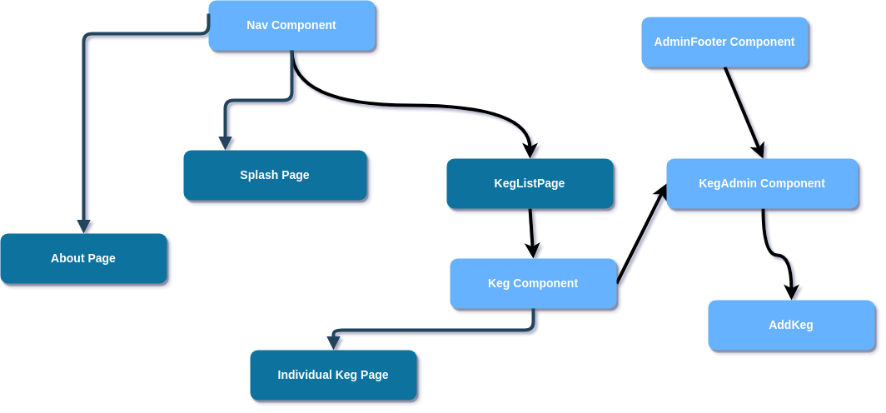

# Petflix

#### By _**Katlin Anderson**_

## Description

_A brewery webpage using React._
_This project was bootstrapped with [Create React App](https://github.com/facebook/create-react-app)._

## Setup/Installation Requirements

* _$ git clone https://github.com/KNBAnderson/tap-room;_
* _$ yarn;_
* _$ yarn build_
* _$ yarn start_
* _Navigate to `http://localhost:3000/`_

## Specs

## Installation Requirements
* Run in browser

## Known Bugs
There are no known bugs.

## Technologies Used

* _HTML_
* _CSS_
* _JavaScript_
* _React_
* _Node_
* _Jest_
* _ESLinter_
* _Babel_

### License

*This software is licensed under the GPL license.*

Copyright (c) 2019 **_Katlin Anderson_**